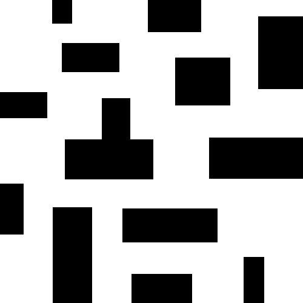

# 路径规划之 Rapidly-Exploring Random Trees (快速扩展随机树)

RRTs 作为一种 single-query 的规划算法被引入，它有效地覆盖了 q<sub>init</sub> 和 q<sub>goal</sub> 之间的空间。该规划器最初也是为 kinodynamic 运动规划而开发的，就像在 ESTs 中一样，只构建一棵树。RRTs 的适用范围超出了 kinodynamic 规划问题。RRT 算法已被证明是概率完备的。



## 构造树

$T$表示一颗树。$T_{init}$和 $T_{goal}$根节分别为$q_{init}$和$q_{goal}$的树。每棵树$T$都是增量扩展的。在每次迭代中，在$Q_{free}$中随机均匀采样一点$q_{rand}$。在$T$中找到距离$q_{rand}$最近的节点$q_{near}$，并尝试从$q_{near}$向$q_{rand}$方向移动一段距离$step\_size$，生成一个新节点$q_{new}$。若该节点是无碰撞的(collision-free)，则添加节点$q_{new}$到$T$的顶点集合(vertices)中，添加$(q_{near}, q_{new})$到$T$的边集合(edges)中。算法伪码见 [Algorithms 10](img/algorithm_10_build_rrt_algorithm.png) 和 [Algorithms 11](img/algorithm_11_extend_rrt_algorithm.png)。[图 7.14](/doc/img/fig7-14_0[1].jpg) 展示了 RRT 在二维欧式空间扩展一个点的过程。


## 算法流程: Planning()

1. 初始化随机树，树结点和边只包含起点$q_{start}$（根节点）。边和书中有一点区别，因为这里的节点用了一个链表结构，这里每个扩展节点($q_{new}$)包含有一个后向指针，指向源节点($q_{near}$)，所以不需要单独定义边。只要构造出树，最后反向遍历即可完成路径的构造。
2. 起始点start加入到树节点和边中
3. 开始迭代
4. `GenerateRandomNode()`: 在状态空间（机械臂的关节空间或者笛卡尔空间；小车可达的二维地图空间）中随机采样一个点$q_{rand}$。为加快RRT到达目标点$q_{goal}$的速度，在随机采样过程中，加随机的概率p来决定，此次扩展的目标点$q_{goal}$是随机点还是目标点$q_{goal}$。当$0<p<prob$时，取随机采样点；否则取目标点$q_{goal}$。这个概率不宜过大，否则容易陷入障碍物包围圈中不容易跳出。
5. `FindNearestNode(qrand)`: 遍历RRT树节点，返回距离$q_{rand}$最近的一个节点$q_{near}$
6. `ExtendTree(qnear, qrand)`: 沿着$(q_{near}, q_{rand})$方向，以一定的步长$step\_size$扩展一个新节点$q_{new}$, 如果扩展不成功（超出地图范围），返回None，放弃这次扩展。
7. `CollsionFree(qnear, qnew)`: 对$(q_{near}, q_{new})$路径进行碰撞检查，包括路径过程中及起始点是否有障碍物。这里采用等间距采样，检查路径中位置点所处网格是否包络障碍物。如果发生碰撞，则放弃扩展。
8. 如果新节点$q_{new}$被接受（新节点不为`None`且与$(q_{near}, q_{new})$之间的路径无碰撞），则将该点加入到树中，并将该节点的后向指针$q_{new}.parent$指向$q_{near}$。这样，在找到目标点时，根据该指针，可遍历得到完整的路径。为了防止树节点过多，可以再检查$q_{new}$是否与树中某个节点过于接近（一般取小于扩展步长），如果是，则也可以放弃此次扩展。但是这也会导致算法时间增长，毕竟要遍历树节点计算距离。
9. `IsArrival(qnew)`: 检查是否到达目标点$q_{goal}$, 如果新节点$q_{new}$距离目标点$q_{goal}$小于扩展步长$step\_size$，且无碰撞，则认为找到，将目标点$q_{goal}$作为树的最后一个节点添加到RRT树中。
10. `FindPath()`: 根据目标节点$q_{goal}$的反向指针，遍历至起点$q_{start}$，即完成路径的构造。
11. `SmoothPath(path)`: 上一步的路径是按照步长一个节点一个节点扩展的，因此这里可以对路径进行圆滑，遍历路径的节点，取最长不碰撞的节点构造新路径。


``` python
    def Planning(self):
        '''
        rrt planning
        '''
        self.AddVertices(self.qstart)
        self.AddEdges(None, self.qstart)

        k = -1
        while k < self.max_steps:
            k += 1
            qrand = self.GenerateRandomNode()
            _, qnear = self.FindNearestNode(qrand)
            qnew = self.ExtendTree(qnear, qrand)
            if qnew and self.CollsionFree(qnear, qnew):
                self.AddVertices(qnew)
                self.AddEdges(qnear, qnew)

                self.DrawEdges(qnear, qnew)

                if self.IsArrival(qnew):
                    print("Found")
                    self.AddVertices(self.qgoal)
                    self.AddEdges(qnew, self.qgoal)

                    path = self.FindPath()
                    self.DrawPath(path)
                    smooth_path = self.SmoothPath(path)
                    self.DrawPath(smooth_path)

                    return True
        print('Not Found')
        return False
```

RRT构造函数

``` python
    '''
    map_path: 地图图片路径
    qstart: 起点坐标 [row, col]
    qgoal: 目标点坐标 [row, col]
    grid_size: 网格大小（用来碰撞检测）
    step_size: 扩展步长
    max_steps: 最大扩展节点数
    goal_prob: 增加趋向目标点概率（贪婪）
    '''

    rrt = RRT(map_path, qstart, qgoal, grid_size,
              step_size, max_steps, goal_prob)
    
```

## 完整源码

``` python
import cv2
import numpy as np
import copy
import random
import math


class Node(object):
    def __init__(self, pos=[0, 0]):
        self.pos = pos
        self.parent = None


class RRT(object):
    def __init__(self, map_path, qstart, qgoal, grid_size, step_size,
                 max_steps=1000, goal_prob=0.0):
        '''
        initialize RRT
        '''
        self.vertices = []  # 树的节点
        self.edges = []  # 树的边
        self.path = []  # 路径
        self.qstart = Node(qstart)  # 起点
        self.qgoal = Node(qgoal)  # 终点
        self.step_size = step_size  # 步长
        self.max_steps = max_steps  # 最大迭代次数
        self.goal_prob = goal_prob  # 随机趋向终点概率
        self.grid_size = grid_size  # 网格边长

        self.MapPreProcess(map_path)  # 初始化地图

    def MapPreProcess(self, map_path):
        '''
        convert map image to binary image
        '''
        self.src_map = cv2.imread(map_path)
        self.map = cv2.cvtColor(self.src_map, cv2.COLOR_BGR2GRAY)
        _, self.map = cv2.threshold(
            self.map, 0, 255, cv2.THRESH_BINARY_INV)

        self.map_shape = np.shape(self.map)

    def GenerateRandomNode(self):
        '''
        qrand = a randomly chosen free configuration
        '''
        if random.random() > goal_prob:
            row = random.randrange(0, self.map_shape[0])
            col = random.randrange(0, self.map_shape[1])
            return Node([row, col])

        return self.qgoal

    def Distance(self, p1, p2):
        '''
        calculate the distance between p1 and p2
        '''
        return math.sqrt((p1[0] - p2[0]) ** 2 + (p1[1] - p2[1]) ** 2)

    def FindNearestNode(self, q):
        '''
        qnear = closest neighbor of q in T
        '''

        min_distance = float('inf')
        for node in self.vertices:
            distance = self.Distance(node.pos, q.pos)
            if distance < min_distance:
                min_distance = distance
                qnear = node

        return min_distance, qnear

    def ExtendTree(self, qnear, qrand):
        '''
        progress qnear by step_size along the straight line in Q(map) between qnear and qrand
        if qrand is close to qnear, ignore qrand and return None
        '''

        vec = [qrand.pos[0] - qnear.pos[0], qrand.pos[1] - qnear.pos[1]]
        norm_vec = math.sqrt(vec[0] ** 2 + vec[1] ** 2)
        if norm_vec < 0.0001:
            return None

        vec = [vec[0] / norm_vec, vec[1] / norm_vec]

        qnew_pos = [int(qnear.pos[0] + self.step_size * vec[0]),
                    int(qnear.pos[1] + self.step_size * vec[1])]

        if qnew_pos[0] < 0 or qnew_pos[0] >= self.map_shape[0]:
            return None

        if qnew_pos[1] < 0 or qnew_pos[1] >= self.map_shape[1]:
            return None

        return Node(qnew_pos)

    def IsObstacle(self, p):
        '''
        check the grid of pos p in map is obstacle or not

        '''
        area = self.map[p[1]: p[1] + self.grid_size,
                        p[0]: p[0] + self.grid_size]
        if np.sum(area):
            return True

        return False

    def CollsionFree(self, qnear, qnew):
        '''
        check qnear to qnew is collsion-free 
        '''
        rows = qnew.pos[0] - qnear.pos[0]
        cols = qnew.pos[1] - qnear.pos[1]
        length = max(abs(rows), abs(cols))

        for i in range(0, length, int(self.grid_size / 2)):
            row = int(qnear.pos[0] + i * rows / length)
            col = int(qnear.pos[1] + i * cols / length)
            if self.IsObstacle([row, col]):
                return False

        # the qnew may not be contained above, confirm qnew check
        return not self.IsObstacle(qnew.pos)

    def AddVertices(self, qnew):
        '''
        add qnew to vertices
        '''
        self.vertices.append(qnew)
        return

    def AddEdges(self, qnear, qnew):
        '''
        here we use a pointer to point to qnear as qnew's parent
        '''
        qnew.parent = qnear
        return

    def DrawEdges(self, qnear, qnew, color=(0, 0, 255), thickness=1):
        '''
        draw the new edge
        '''
        cv2.line(self.src_map, tuple(qnear.pos), tuple(qnew.pos),
                 color, thickness)
        cv2.imshow('RRT', self.src_map)
        cv2.waitKey(5)

    def IsArrival(self, qnew):
        '''
        if the distance between qnew and qgoal less than threshold, 
        and the path of qnew to qgoal is collsion-free, 
        the next vertices is qgoal, obviously
        '''
        if self.Distance(qnew.pos, self.qgoal.pos) > self.step_size:
            return False

        if self.CollsionFree(qnew, self.qgoal):
            return True

        return False

    def FindPath(self):
        '''
        find the complete path with node in vertices propagate with parent pointer
        '''
        node = self.vertices[-1]
        self.path.append(node)
        while node.parent:
            self.path.append(node.parent)
            node = node.parent

        self.path.reverse()
        return self.path

    def DrawPath(self, path, color=None, thickness=3):
        '''
        draw the complete path
        '''
        if color is None:
            color = (random.randint(0, 255),
                     random.randint(0, 255),
                     random.randint(0, 255))

        node = path[0]
        for next_node in path:
            cv2.line(self.src_map, tuple(node.pos), tuple(next_node.pos),
                     color, thickness)
            cv2.imshow('RRT', self.src_map)
            cv2.waitKey(5)
            node = next_node
        return

    def SmoothPath(self, path):
        '''
        smooth path
        '''
        smooth_path = [path[0]]
        pre_node = path[0]
        cur_node = []
        next_node = []
        # pre_node(0) ...... cur_node(0), next_node(0)
        # if pre_node -> next_node is collsion, then the new edge is pre_node -> cur_node.
        # the next iterator is:
        # pre_node(cur_node(0)) ...... cur_node(next_node(0)), next_node
        for next_node in path:
            if self.CollsionFree(pre_node, next_node) == False:
                smooth_path.append(cur_node)
                pre_node = cur_node
            cur_node = next_node

        # the last node
        smooth_path.append(cur_node)
        return smooth_path

    def Planning(self):
        '''
        rrt planning
        '''
        self.AddVertices(self.qstart)
        self.AddEdges(None, self.qstart)

        k = -1
        while k < self.max_steps:
            k += 1
            qrand = self.GenerateRandomNode()
            _, qnear = self.FindNearestNode(qrand)
            qnew = self.ExtendTree(qnear, qrand)
            if qnew and self.CollsionFree(qnear, qnew):
                self.AddVertices(qnew)
                self.AddEdges(qnear, qnew)

                self.DrawEdges(qnear, qnew)

                if self.IsArrival(qnew):
                    print("Found")
                    self.AddVertices(self.qgoal)
                    self.AddEdges(qnew, self.qgoal)

                    path = self.FindPath()
                    self.DrawPath(path)
                    smooth_path = self.SmoothPath(path)
                    self.DrawPath(smooth_path)

                    return True
        return False


if __name__ == "__main__":

    map_path = 'map/area.png'
    qstart = [20, 20]
    qgoal = [480, 480]
    max_steps = 1000
    step_size = 20
    goal_prob = 0.01
    grid_size = 10

    rrt = RRT(map_path, qstart, qgoal, grid_size,
              step_size, max_steps, goal_prob)
    rrt.Planning()
    cv2.waitKey(0)


```


