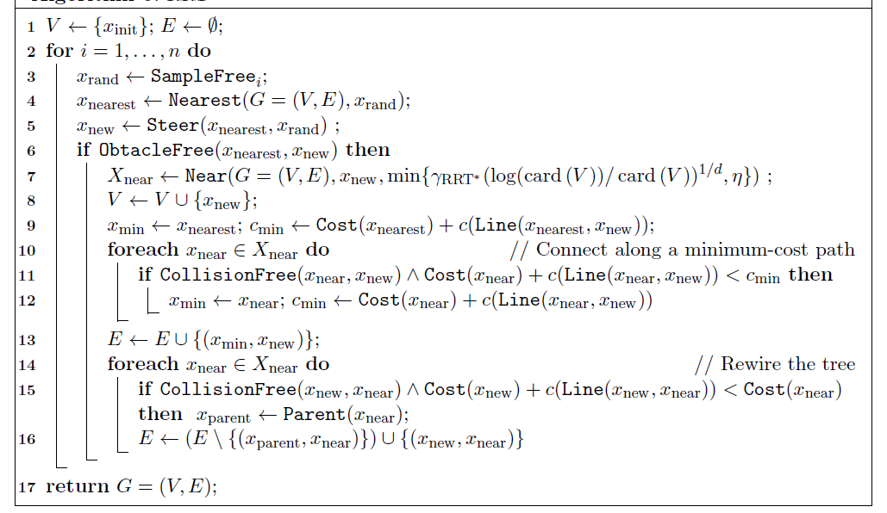

# 路径规划之 RRT_Star 

RRT_Connect相对于RRT虽然增加了启发式策略和贪婪思想，但他们的路径都不是最优的。搜索路径都是基于随机采样，缺少评价函数。RRT_Star算法在RRT的基础上，基于代价函数来重新选择新父节点，重新布线新子节点，保证算法渐进最优解。


## 算法描述

RRT_Star构造方式和RRT类似，区别在于重新选择父节点和重新布线这个过程。在寻找到新节点$q_{new}$时，先进行碰撞检测，若($q_{near}$， $q_{new}$)没有碰撞，并不立即将新节点和新边加入到树中。而是首先**重新选择父节点**：*寻找以$q_{new}$为圆心，以半径$r$内的所有邻接节点，作为$q_{new}$的潜在父节点$q_{proential_parents}$。然后遍历所有潜在父节点，若$q_{protential\_parents}$到$q_{new}$无碰撞，则计算从起点$q_{start}$到潜在父节点$q_{protential\_parents}$，再到新节点$q_{new}$的总路径长。选择最短路径的潜在父节点(假设记为$q_{min\_parent}$)作为$q_{new}$的父节点，添加边($q_{min\_parent}, q_{new}$)到树中*。 在完成父节点的重新选择后，再对该邻域**重新布线**：*再次遍历该邻接节点集合中除$q_{min\_parent}$之外的剩余节点，作为$q_{new}$的潜在子节点$q_{proential\_children}$，若$q_{new}$到$q_{protential\_children}$无碰撞，则计算从起点$q_{start}$到新节点$q_{new}$，再到潜在子节点$q_{protential\_children}$的总路径长。选择最短路径的潜在子节点(假设记为$q_{min\_child}$)，将该节点的父节点设置为$q_{new}$的新节点，删除边($q_{parent\_of\_min\_child}$, $q_{min\_child}$)添加边($q_{new}$, $q_{min\_parent}$)到树中*。因为我们通过链表来构建树，所以设置父节点也相当于添加边；更改父节点，相当于删除了原来的边并添加新边。通过上述两次选择，使得RRT_Star达到渐进最优，并且构造树的节点和边大大减少，提高的搜索效率。

### 伪码



## 实现

### 数据结构

```python
class Node(object):
    def __init__(self, pos=[0, 0]):
        self.pos = pos
        self.parent = None
```

### 接口

``` python
    '''
    map_path: 地图图片路径
    qstart: 起点坐标 [row, col]
    qgoal: 目标点坐标 [row, col]
    grid_size: 网格大小（用来碰撞检测）
    step_size: 扩展步长
    neighbor_radius: 邻域半径，有公式计算的，这里为简单起见，选择定制
    max_steps: 最大扩展节点数
    goal_prob: 增加趋向目标点概率（贪婪）
    '''

    rrt_star = RRT_STAR(map_path, qstart, qgoal, grid_size,
                        step_size, parent_radius, max_steps, goal_prob)
    
```

### Planning

``` python
    def Planning(self):
        '''
        RRT_STAR planning
        '''
        
        # 初始化树，添加起点
        vertices = []
        self.AddVertices(self.qstart, vertices)
        self.AddEdges(None, self.qstart)

        # 开始扩展
        k = 0
        while k <= self.max_steps:
            k += 1

            # 随机采样节点qrand，
            
            # 扩展新节点qnew
            qrand = self.GenerateRandomNode(
                [0, self.map_shape[0]], [0, self.map_shape[1]],
                self.qgoal, self.goal_prob)

            # 遍历树节点 vertices，选择距离最近的节点 qnear
            _, qnear = self.FindNearestNode(qrand, vertices)

            # 扩展新节点 qnew
            qnew = self.ExtendTree(qnear, qrand, self.step_size)

            # 判断 qnew 扩展成功，且(qnear, qnew)无碰撞
            if qnew and self.CollsionFree(qnear, qnew, self.grid_size):

                # 寻找以qnew为圆心，parent_radius为半径的圆内邻接节点neighbors_free
                neighbors_free = self.FindNeighbors(
                    qnew, vertices, self.parent_radius)

                '''
                neighbors = list(filter(lambda qnode: self.Distance(
                    qnode.pos, qnew.pos) < self.parent_radius, vertices))
                neighbors_free = []
                for parent in neighbors:
                    if self.CollsionFree(parent, qnew, self.grid_size):
                        neighbors_free.append(parent)
                '''

                # 重新选择父节点：
                # 计算路径代价Cost(qstart, neighbors_free, qnew),
                # 选择最短路径的潜在父节点作为qnew的新父节点qnew_parent，并将新边加入到树中
                len_qnew_path, qnew_parent = self.RewireNewParent(
                    qnew, vertices, neighbors_free)

                '''
                len_qnew_path = float('inf')
                qnew_parent = None
                for parent in neighbors_free:
                    parent_path = self.FindPathByParentPointer(parent)
                    len_parent_path = self.CalculatePathLength(parent_path)
                    tmp_len_path = len_parent_path + \
                        self.Distance(qnew.pos, parent.pos)

                    if tmp_len_path < len_qnew_path:
                        len_qnew_path = tmp_len_path
                        qnew_parent = parent                

                self.AddVertices(qnew, vertices)
                self.AddEdges(qnew_parent, qnew)
                self.DrawEdges(self.src_map, qnew_parent, qnew)
                '''

                # 重新布线：
                # 计算neighbors_free中除qnew_parent外的路径代价Cost(qstart, qnew, neighbors_free),
                # 选择最短路径的节点qnew_children，设置其父节点为qnew，并将新边加入到树中
                if qnew_parent:
                    neighbors_free.remove(qnew_parent)
                self.RewireNewChild(qnew, len_qnew_path, neighbors_free)
                '''
                qnew_children = None
                for child in neighbors_free:
                    tmp_len_path = len_qnew_path + \
                        self.Distance(qnew.pos, child.pos)

                    if self.CollsionFree(child, qnew, self.grid_size):
                        child_path = self.FindPathByParentPointer(child)
                        if tmp_len_path < self.CalculatePathLength(child_path):
                            qnew_children = child
                            self.AddEdges(qnew, qnew_children)
                            self.DrawEdges(self.src_map, qnew,
                                           qnew_children)
                '''

                # 检查两棵树是否相连,若相连，则完成路径规划
                if self.IsArrival(qnew, self.qgoal, self.step_size):
                    print("Found")

                    # 如果两棵树连上了，说明找到路径了，把最后一个节点添加到树中。
                    self.AddVertices(self.qgoal, vertices)
                    self.AddEdges(qnew, self.qgoal)
                    self.DrawEdges(self.src_map, qnew, self.qgoal)

                    # 构建路径
                    path = self.FindPath(vertices)
                    self.DrawPath(self.src_map, path)

                    # 圆滑路径
                    smooth_path = self.SmoothPath(path, self.grid_size)
                    self.DrawPath(self.src_map, smooth_path)

                    return True

        print("NotFound")
        return False
```

## 参考资料：  
[1]: Karaman S, Frazzoli E. Sampling-based algorithms for optimal motion planning[J]. The international journal of robotics research, 2011, 30(7): 846-894.
[2]: Choset. Principles of Robot Motion: Theory, Algorithms, and Implementations[J]. Proceedings of the Society for Experimental Biology & Medicine Society for Experimental Biology & Medicine, 2005, 147(1):512-512.
[3]: https://blog.csdn.net/weixin_43795921/article/details/88557317
[4]: https://www.cnblogs.com/guojun-junguo/p/10198144.html

